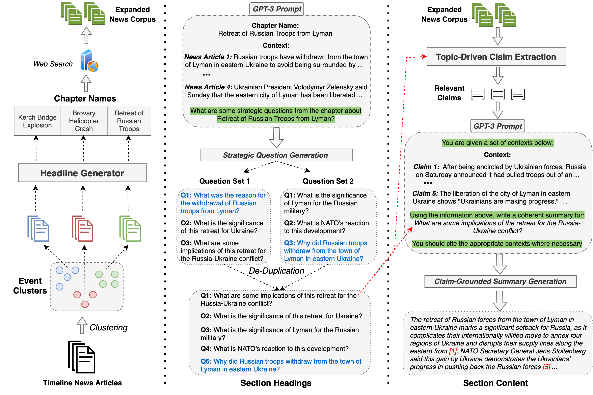
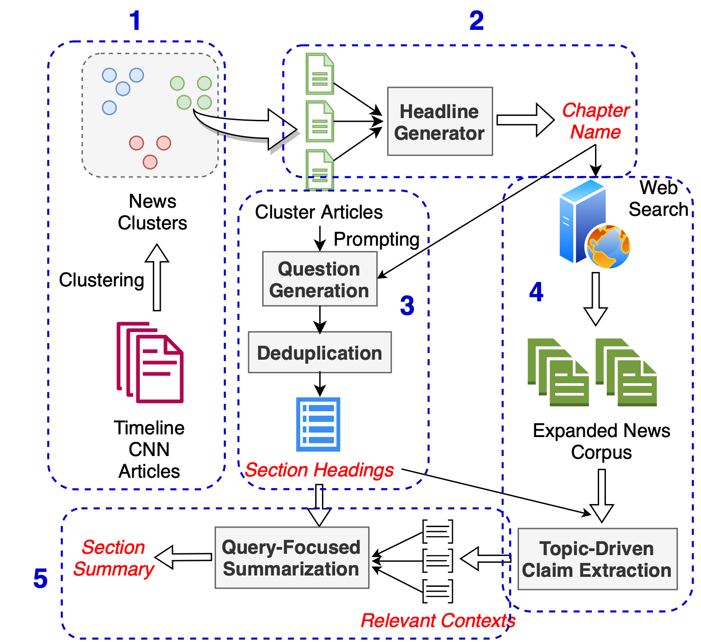

# SmartBook

SmartBook is a novel task for generating situation reports: given large volumes of news data, produce a structured report with multiple hypotheses (claims) summarized and grounded (linked) to sources with factual evidence. These reports are structured as a sequence of timespans, each consisting of major events (as chapters), subdivided by strategic questions (as section headers) with their grounded summaries (as section content).



This repository contains the code and instructions to generate automated situation reports using our **SmartBook** framework.

Below are the different steps in our SmartBook framework:
1. News article clustering
2. Headline generation for the clusters
3. Strategic question generation and de-duplication
4. Question-driven claim extraction and validation
5. Grounded summarization



<br>

## Getting the news data

SmartBook can be used to generate analysis reports for any news scenario. You just need to provide the input news articles to be used for generating SmartBook.

To create SmartBook reports for the *Ukraine-Russia* war scenario, you can first scrape the articles by following the instructions [here](examples/Ukraine-Russia/README.md) before running the code below. 

`input_dir`: The input is a folder with raw text files, with the name of the file being used as the file id.

`output_dir`: The output directory will contain the outputs of the clustering and headline generator steps.

**Note**: You need to enable write permissions to the output directory:
```
chmod 777 <path to output_dir>
```

## Clustering

The clustering approach is based on Agglomerative clustering over TF-IDF features. 

Below are the steps to run the clustering code:

- Pull the docker container: 
```
docker pull blendernlp/covid-claim-radar:revanth3_clustering_v1
```
- Set the input and output dir paths:
```
export INPUT_DIR_PATH=path to input_dir
export OUTPUT_DIR_PATH=path to output_dir
```
- Run the clustering code with by pointing to the input and output directory paths
```
docker run  --rm -v ${INPUT_DIR_PATH}:/var/spool/input/ -v ${OUTPUT_DIR_PATH}:/var/spool/output/ -t blendernlp/covid-claim-radar:revanth3_clustering_v1
```
- The clustering code takes the below two arguments:
    - *MAX_FEATURES* (default=3000): Number of features to use for the TF_IDF Vectorizer. Increasing this will increase the number of clusters.
    - *DISTANCE_THRESHOLD* (default=1.25): Distance between the clustering before considering to merge them. Decreasing this will lower the number of clusters.
To run the clustering code with custom parameters, you can pass these as environment variables
```
docker run  --rm -v ${INPUT_DIR_PATH}:/var/spool/input/ -v ${OUTPUT_DIR_PATH}:/var/spool/output/ --env MAX_FEATURES=2500 --env DISTANCE_THRESHOLD=1.3 -t revanth3:clustering_v1
```

The code generates a file `output_clusters.json` in the output directory: `output_dir`

**Note**: There is a post-processing step to prune those clusters which contain less than 4 items 

## Headline Generation

The Headline Generator creates a short headline for each cluster.

**Note**: The headline generator requires a GPU to run.

Below are the steps to run the headline generator code:
- Pull the docker container: 
```
docker pull blendernlp/covid-claim-radar:headline_generator_v1
```
- Set the input and output dir paths:
```
export INPUT_DIR_PATH=path to output_dir
export OUTPUT_DIR_PATH=path to output_dir
```
- Run the headline generator code:
```
docker run  --rm --gpus all -v ${INPUT_DIR_PATH}:/var/spool/input/ -v ${OUTPUT_DIR_PATH}:/var/spool/output/ -t blendernlp/covid-claim-radar:headline_generator_v1
```

The above code takes as input the previously generated `output_clusters.json` and generates the headline output `output_headline.json` in `output_dir`.

## Identifying Strategic Questions

**Note**: The questions are generated using GPT-3, hence you need an OpenAI API key to run this step

Below are the steps to run the strategic question generator code:
- Pull the docker container: 
```
docker pull blendernlp/covid-claim-radar:revanth3_question_v1
```
- Set the input and output dir paths:
```
export INPUT_DIR_PATH=path to output_dir
export OUTPUT_DIR_PATH=path to output_dir
```
- Run the headline generator code:
```
docker run  --rm --gpus all -v ${INPUT_DIR_PATH}:/var/spool/input/ -v ${OUTPUT_DIR_PATH}:/var/spool/output/ --env OPENAI_KEY=<openai_key_here> -t blendernlp/covid-claim-radar:revanth3_question_v1
```

The above code takes as input the previously generated `output_headline.json` and generates the question output `output_questions.json` in `output_dir`.

## Claim Extraction and Validation

The claim extraction module is based on our previous work: [A Zero-Shot Claim Detection Framework Using Question Answering](https://aclanthology.org/2022.coling-1.603/)

**Note:** The claim extraction and validation module requires a GPU to run.

Below are the steps to run the claim extraction and verification code:
- Pull the docker container: 
```
docker pull blendernlp/covid-claim-radar:revanth3_claim_extraction_v1
```
- Set the input and output dir paths:
```
export INPUT_DIR_PATH=path to output_dir
export OUTPUT_DIR_PATH=path to output_dir
```
- The claim extraction code has two options: 
    - *Running with the same corpus*: This option uses the cluster's articles as the corpurs to extract claims from
    ```
    docker run  --rm --gpus all -v ${INPUT_DIR_PATH}:/var/spool/input/ -v ${OUTPUT_DIR_PATH}:/var/spool/output/ -t blendernlp/covid-claim-radar:revanth3_claim_extraction_v1
    ```
    - *Running with an expanded corpus*: Additionally, the code provides an option to get an expanded set of news articles by search google news with the cluster headline as the query. <br><br> **Note:** You need to subscribe to [SerpAPI](https://serpapi.com/) to be able to search Google News. Additionally you'll need to provide `start_date` and `end_date` parameters (in *yyyy-mm-dd* string format) to define which timeperiod you want these expanded news articles from. 
    ```
    docker run  --rm --gpus all -v ${INPUT_DIR_PATH}:/var/spool/input/ -v ${OUTPUT_DIR_PATH}:/var/spool/output/ --env SERPAPI_KEY=<serpapi_key_here> --env START_DATE=<start_date_here> --env END_DATE=<end_date_here> -t blendernlp/covid-claim-radar:revanth3_claim_extraction_v1
    ```

The above code takes as input the previously generated `output_questions.json` and generates the claim output `output_claims.json` in `output_dir`.

## Grounded Summarization

**Note**: The grounded summaries are generated using GPT-3, hence you need an OpenAI API key to run this step

Below are the steps to run the summarization  code:
- Pull the docker container: 
```
docker pull blendernlp/covid-claim-radar:revanth3_summarization_v1
```
- Set the input and output dir paths:
```
export INPUT_DIR_PATH=path to output_dir
export OUTPUT_DIR_PATH=path to output_dir
```
- Run the headline generator code:
```
docker run  --rm --gpus all -v ${INPUT_DIR_PATH}:/var/spool/input/ -v ${OUTPUT_DIR_PATH}:/var/spool/output/ --env OPENAI_KEY=<openai_key_here> -t blendernlp/covid-claim-radar:revanth3_summarization_v1
```

The above code takes as input the previously generated `output_claims.json` and generates the summary output `output_summaries.json` in `output_dir`.


If you found this repo useful for your work, please consider citing our papers:

```
@article{reddy2023smartbook,
  title={SmartBook: AI-Assisted Situation Report Generation},
  author={Reddy, Revanth Gangi and Fung, Yi R and Zeng, Qi and Li, Manling and Wang, Ziqi and Sullivan, Paul and others},
  journal={arXiv preprint arXiv:2303.14337},
  year={2023}
}
```

```
@inproceedings{reddy2022zero,
  title={A Zero-Shot Claim Detection Framework using Question Answering},
  author={Reddy, Revanth Gangi and Chinthakindi, Sai Chetan and Fung, Yi R and Small, Kevin and Ji, Heng},
  booktitle={Proceedings of the 29th International Conference on Computational Linguistics},
  pages={6927--6933},
  year={2022}
}
```

